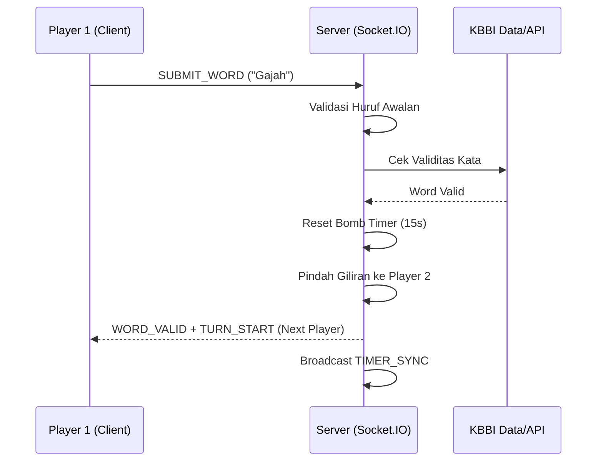

# Laporan Pengembangan Proyek: Sambung Kata

## 1. Pembahasan Perancangan Sistem
Proyek **Sambung Kata** dirancang sebagai aplikasi permainan kata multipemain (multiplayer) secara *real-time*. Tujuan utama sistem ini adalah menyediakan platform di mana pemain dapat bertanding menguji kosa kata bahasa Indonesia mereka dengan aturan rantai kata (kata berikutnya harus dimulai dengan huruf terakhir dari kata sebelumnya).

Sistem dirancang dengan pendekatan **Server-Authoritative**, di mana logika permainan, validasi kata, dan pengaturan waktu (*timer*) dikelola sepenuhnya oleh server untuk mencegah kecurangan dan memastikan sinkronisasi antar pemain tetap konsisten.

## 2. Arsitektur Aplikasi & Tech Stack
Aplikasi ini menggunakan arsitektur *monorepo* yang memisahkan antara *Frontend* dan *Backend* untuk memudahkan pengembangan dan skalabilitas.

### Tech Stack:
*   **Backend:**
    *   **Runtime:** [Bun](https://bun.sh/) (Dipilih karena performa tinggi dan ekosistem terintegrasi).
    *   **Framework:** [Hono](https://hono.dev/) (Minimalis dan cepat).
    *   **Real-time:** [Socket.IO](https://socket.io/) (Untuk komunikasi dua arah rendah latensi).
    *   **Validation:** Dataset offline (112k+ kata KBBI) dengan *fallback* ke REST API eksternal.
*   **Frontend:**
    *   **Framework:** [React 19](https://react.dev/) + [Vite 8](https://vite.dev/).
    *   **Styling:** [Tailwind CSS v4](https://tailwindcss.com/) & [shadcn/ui](https://ui.shadcn.com/).
    *   **State Management:** [Zustand](https://zustand-demo.pmnd.rs/) (Manajemen state game di sisi klien).
    *   **Data Fetching:** [TanStack Query v5](https://tanstack.com/).
*   **Infrastruktur:**
    *   **Backend Hosting:** Railway (via Docker).
    *   **Frontend Hosting:** Vercel.

## 3. Diagram Alur Data
Alur data utama dalam permainan ini mengikuti siklus berikut:

## 4. Implementasi Fitur Real-time
Fitur *real-time* adalah inti dari pengalaman pengguna dalam game ini. Implementasi dilakukan menggunakan **Socket.IO** dengan beberapa mekanisme kunci:
*   **Room Management:** Pemain dikelompokkan dalam *room* unik. Semua kejadian (event) disiarkan hanya ke anggota room tersebut.
*   **State Synchronization:** Server mengirimkan event `SYNC_ROOM` dan `TIMER_SYNC` setiap detik untuk memastikan semua klien melihat sisa waktu bomb yang sama.
*   **Event-Driven Gameplay:** Pergantian giliran dipicu oleh event `TURN_START` yang membawa informasi ID pemain aktif, durasi waktu, dan huruf yang harus digunakan.

## 5. Tantangan Selama Pengembangan
Dalam proses pengembangan, ditemukan beberapa tantangan teknis:
1.  **Stabilitas Alur Game Over:** Modal hasil permainan sempat tertutup cepat dan alur reset room tidak konsisten.
2.  **Penentuan Giliran Host:** Pada beberapa sesi, host tidak mendapatkan giliran pertama sehingga input kata ditolak.
3.  **Koneksi WebSocket di Produksi:** Frontend gagal tersambung karena URL Socket.IO dan CORS di production belum sinkron.
4.  **Masalah Deployment Railway:** Build gagal karena konfigurasi builder, root directory, dan healthcheck yang tidak sesuai monorepo.

## 6. Solusi yang Diterapkan
Untuk mengatasi tantangan di atas, diterapkan solusi sebagai berikut:
1.  **Penguncian Alur Game Over:** Status room ditetapkan ke `finished` saat game berakhir, lalu reset room hanya terjadi setelah event restart, sehingga modal tetap stabil dan pemain dapat memilih aksi.
2.  **Host Selalu Giliran Pertama:** ID host dihitung konsisten dari `hostSocketId`, lalu dipakai sebagai `firstPlayerId` ketika game dimulai.
3.  **Konfigurasi Socket.IO Produksi:** Menggunakan `VITE_WS_URL` di frontend dan `CORS_ORIGINS` di backend agar WebSocket menggunakan domain Railway dan tidak terblokir.
4.  **Deploy Monorepo via Dockerfile Root:** Mengarahkan Railway memakai `Dockerfile` root dan healthcheck `/api/health` supaya build dan start command tidak salah path.
