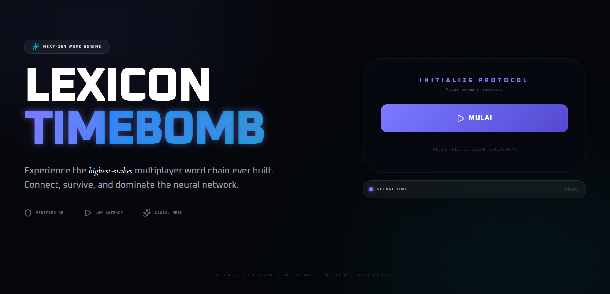

# Lexicon Timebomb (Word Chain Game)

<p align="center">
  
  
  
  
  
  
  
  
</p>

<!-- README-I18N:START -->

**English** | [Bahasa Indonesia](./README.md)

<!-- README-I18N:END -->

Lexicon Timebomb is a real-time multiplayer word chain game. Two players compete to submit words that start with the last letter of the previous word. If time runs out, you lose!

## Preview

<p align="center">
  
</p>

## Key Features

- **Real-Time Multiplayer** — Two players compete simultaneously via WebSocket
- **KBBI Validation** — Every word is validated against Kamus Besar Bahasa Indonesia
- **Bomb Timer** — 15-second countdown with dynamic visual effects
- **Scoring System** — Real-time scoring for each valid word
- **Sound Effects** — Procedural audio via Web Audio API (no external files)
- **Responsive** — Optimized for desktop and mobile

## Tech Stack

### Backend
- **Hono** — Modern, fast web framework
- **Socket.IO** — Real-time communication
- **TypeScript** — Type safety
- **Bun** — JavaScript runtime

### Frontend
- **React** — UI library
- **Vite** — Build tool
- **TypeScript** — Type safety
- **Tailwind CSS** — Utility-first styling
- **shadcn/ui** — Ready-to-use UI components
- **Zustand** — State management

## How to Run

### Prerequisites
- Node.js v18+ or Bun
- npm or bun

### Installation

```bash
# Clone repository
git clone <repository-url>
cd root

# Install backend dependencies
cd backend && bun install   # or: npm install
cd ../frontend && npm install   # or: bun install
```

### Environment Setup

Copy `.env.example` to `.env` in each directory:

```bash
# Backend
cp backend/.env.example backend/.env

# Frontend
cp frontend/.env.example frontend/.env
```

Adjust variable values in `backend/.env` and `frontend/.env` if needed.

### Run Backend

```bash
cd backend
bun run index.ts / bun run dev
```

Backend runs at `http://localhost:3001`

### Run Frontend

```bash
cd frontend
npm run dev / bun run dev
```

Frontend runs at `http://localhost:5173`

## How to Play

1. **Create Room** — Click "Host", enter your name, get a room code
2. **Share Code** — Share the room code with your friend
3. **Join Room** — Friend enters room code and name to join
4. **Start Game** — Host starts when there are 2 players
5. **Chain Words** — Players take turns submitting words starting with the last letter of the previous word
6. **Time Limit** — Each turn has a 15-second timer
7. **Game Over** — If a player fails to answer within the time limit, they lose

### Game Rules

- Minimum word length: 3 characters
- Words must be valid according to KBBI
- Words cannot be used twice
- Words must start with the last letter of the previous word

## Project Structure

```
root/
├── backend/                 # Backend server
│   ├── src/
│   │   ├── socket/        # Socket.IO handlers
│   │   ├── game/          # Game logic & timer
│   │   ├── routes/        # API routes
│   │   ├── dictionary/    # KBBI validation
│   │   └── data/          # KBBI word list
│   └── package.json
├── frontend/              # Frontend client
│   ├── src/
│   │   ├── components/    # UI components
│   │   ├── hooks/         # Custom hooks
│   │   ├── stores/        # Zustand stores
│   │   └── lib/           # Utilities
│   └── package.json
├── docs/                  # Documentation
└── README.md              # This file
```

## API Endpoints

### Health Check
```
GET /api/health
```

### Check Room
```
GET /api/room/:code
```

### Validate Word
```
GET /api/dictionary/check/:word
```

## Socket Events

### Client → Server
- `CREATE_ROOM` — Create new room
- `JOIN_ROOM` — Join existing room
- `START_GAME` — Start the game
- `SUBMIT_WORD` — Submit a word

### Server → Client
- `ROOM_CREATED` — Room successfully created
- `PLAYER_JOINED` — New player joined
- `TURN_START` — Turn started
- `WORD_VALID` — Word is valid
- `WORD_INVALID` — Word is invalid
- `TIMER_SYNC` — Timer synchronization
- `GAME_OVER` — Game ended

## Deployment

### Backend to Railway
```bash
cd backend
railway init
railway up
```

### Frontend to Vercel
```bash
cd frontend
vercel
```

[↑ Back to top](#)

## Contributing

Pull requests are welcome for improvements and fixes.

## License

This project was created for UAS Web Programming assignment.

